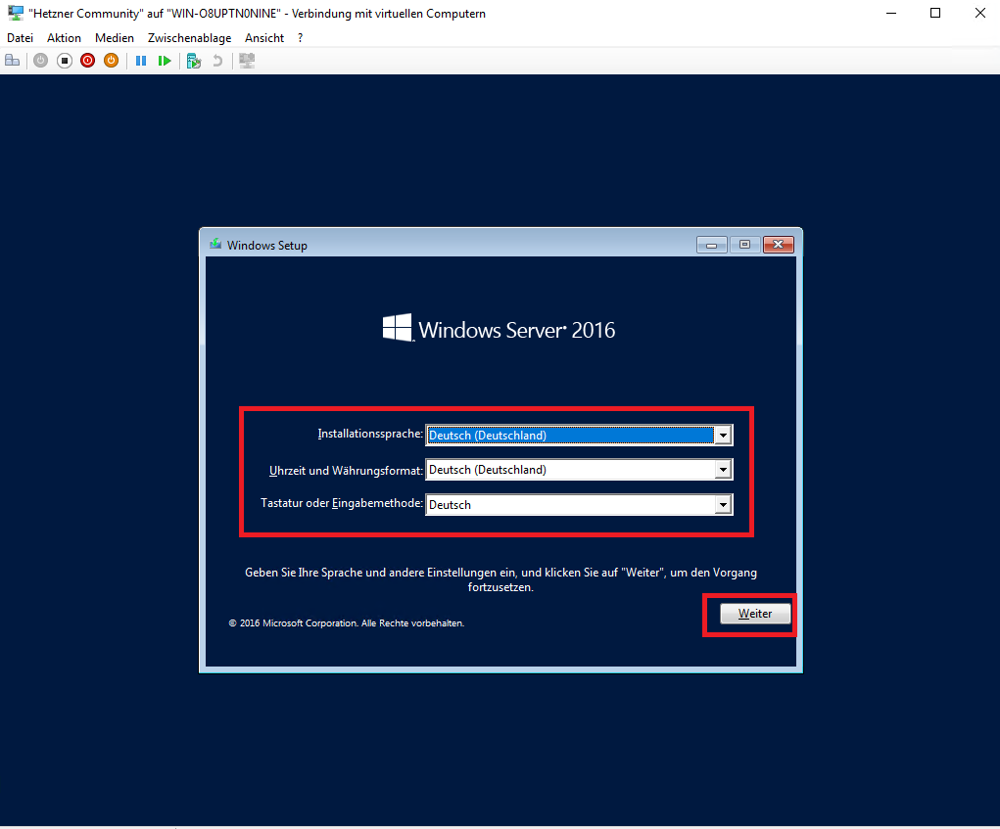

## Introduction

Hello and welcome to my tutorial. There is not much you can do wrong so go ahead and have fun with your server.

**Prerequisites**

You need a server. If you do not already have one, make sure to read step one before purchasing one. This entire tutorial has been tested to work on Hetzner servers, and will be based on that.

## Step 1 - Order Server

If you have not already done so, purchase a server. On the configuration page, choose "Rescue-System" as the OS, we will later install Windows.
If you have already purchased a server, head to step 2 BUT save your data from the server, as !ALL FILES WILL BE DELETED!

## Step 2 - Order KVM

When your server is online you can log in to your Robot. Head to the "Servers" tab and expand the server you would like to add your own license to. Click on the "Support" tab and as a request type choose Remote Console (KVM). I recommend requesting at least 2 hours. You can also choose a time for when you want it.

It is important that in the text field you specify that you would like to have a USB stick with a Windows Server (2008, 2012, 2016) (Datacenter, Standard) ISO loaded onto your Server.

## Step 3 - Install Windows

After Support has finished setting up the KVM, you can now login by simply following the link, login and download the file.

Now you should see Windows installing.

When the Windows setup starts, choose your keyboard and the language preferences you want and click "continue".

Click on "Install now".

Choose the Windows variant you would like to use. IMPORTANT: You need to install the version with (Desktop view) behind the name, if you do not you will only get a command shell. For this tutorial I used Windows Server 2016 Standard. Click on "continue".

Accept the license and click on "continue".

Now choose custom. 

Click on the drive you wish to install Windows on (in this case there is only one) and click "continue".

Now you must wait for your server to finish installing Windows.

Next, set a password for the administrator account.

## Conclusion ##

Following these steps you have installed Windows with your own license on a server. You can now install additional software and setup the server the way you want to.

##### License: MIT

<!---

Contributors's Certificate of Origin

By making a contribution to this project, I certify that:

(a) The contribution was created in whole or in part by me and I have
    the right to submit it under the license indicated in the file; or

(b) The contribution is based upon previous work that, to the best of my
    knowledge, is covered under an appropriate license and I have the
    right under that license to submit that work with modifications,
    whether created in whole or in part by me, under the same license
    (unless I am permitted to submit under a different license), as
    indicated in the file; or

(c) The contribution was provided directly to me by some other person
    who certified (a), (b) or (c) and I have not modified it.

(d) I understand and agree that this project and the contribution are
    public and that a record of the contribution (including all personal
    information I submit with it, including my sign-off) is maintained
    indefinitely and may be redistributed consistent with this project
    or the license(s) involved.

Signed-off-by: TaktischerSpeck - Vincent Buß, vincent.buss@thelastgamer.de

-->
