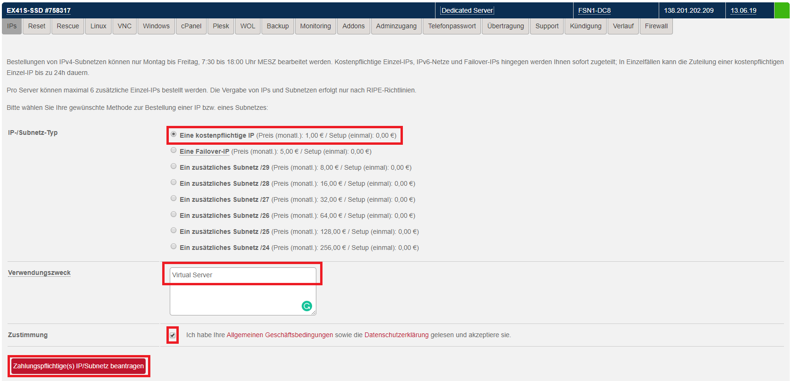
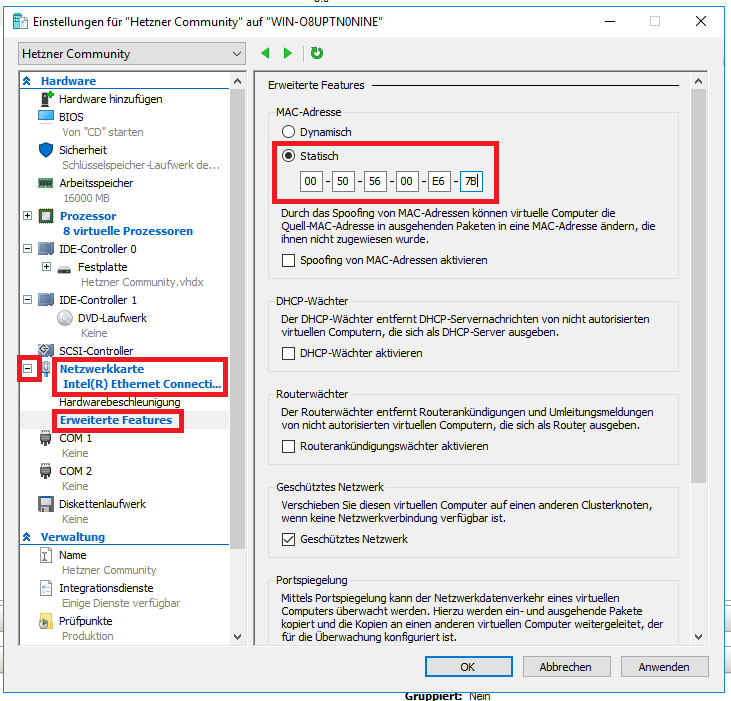
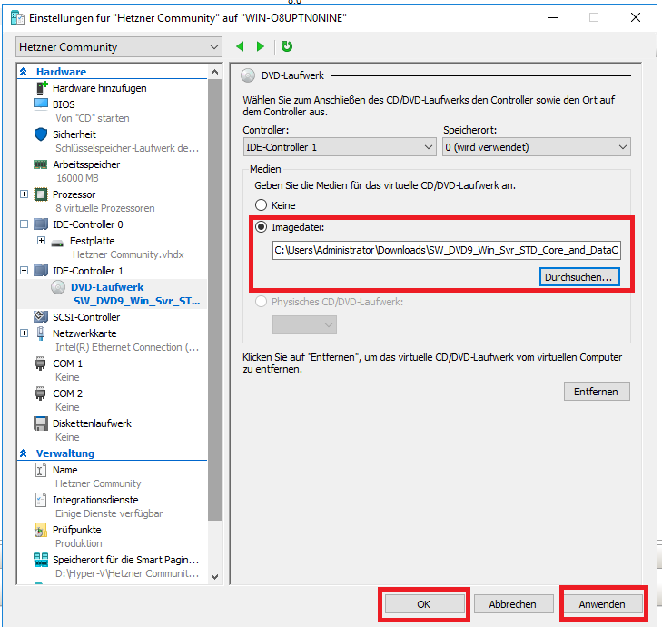

## Introduction

Hello, I am going to show you how to install your own virtual Windows server on an existing Windows server. This entire tutorial has been tested to work on Hetzner servers, and will be based on that.

**Prerequisites**

* Download the ISO file of the Windows version you want. This can be done via the Hetzner mirror - if you already have a server located in the Hetzner network (like the backup spaces) - here: "http://mirror.hetzner.de/bootimages/windows/".
* Additional IP (The buying process is going to be included in the tutorial)
* Windows server (This tutorial works with Windows Server 2016, other versions could have differences)
* Remote desktop connection to the Windows server

## Step 1 - Order Additional IP

This step is only needed if you have not already bought an additional IP, if you have, proceed with step 2.

Login to your [Robot account](https://robot.your-server.de), click on server and click on the server which you want to add the IP to.

When you expand your server, click on "IPs" and then on the grey button in the left bottom corner "Order additional IPs / networks".

Now choose "A paid IP (price (monthly): 1.00 € / Setup (once): 0.00 €)" and write as a reason for wanting the IP "Virtual Server".

When your IP order has arrived, proceed with step 2.

## Step 2 - Add Mac Address

Click on the network icon to the right of the IP labeled "Request separate MAC".

Now click on the red "Request separate MAC" button, now you should see a MAC Address which should look like this: MAC: 00:50:56:00:E5:7B

Write down the MAC address for later.

### Step 3 Install Hyper-V

Login to your Windows server via remote desktop.

Start your server manager and click on "Add Role or feature".

Skip every side until you come to Server role, there you click on the "Hyper-V" box and click "Add Features".

Now Skip until you can press "install". After the install please restart your server.

## Step 4 Setup the Virtual Server

Start Hyper-V, if you are not automatically connected right-click on Hyper-V Manager and connect with your local computer.

Click at the right side on "New -> Virtual Computer".

Now choose a name, it can be any name, also you can assign a path where the VM should be installed to. Click next.

Chose Generation 1. Click next.

Now you can Setup the RAM of the Server. You can also activate Dynamic RAM which means that the server does not use as an example, 16GB RAM, every time, the server uses the RAM it needs + 20% buffer. If the server needs less RAM your main server will need less RAM too.

In this tutorial 16GB ram with Dynamic RAM was chosen. Click next.

Leave the network config on "Not Connected". Click next.

Now you can choose which size your drive is going to have. Windows needs about 25GB. Also, you can edit the path. Click next.

Now click on "Install OS Later". Click next.

Click on "Finish"

Right click on your new virtual machine and click on Settings.

Now you can edit the hardware of the server.

I would recommend to increase the core count for the install at least.

Head to network card and chose your virtual switch connection.

After this expand "network card" by clicking the plus and go to extended Features.

Click on Static MAC Address and fill in your previous copied MAC Address then Click on "Apply" and "OK".

You can now assign how many cores your VM should be able to use. For the install I would assign the core count that the system has minus one. Also you can reassign RAM (8-12 GB should be more than enough).

Now head to "IDE-Controller 1" and click on "DVD Drive".

Click on an image file and now "search" the ISO you downloaded before.

Click "apply" and "ok"

## Step 5 Setting up Windows

Double click on the name of your virtual machine and then click on "Start".

Now you should see the Hyper-V logo, followed by loading files and a Windows Logo.

When the Windows setup starts chose the keyboard and language preferences you want and click on "continue".

Click on "Install now".

Choose the Windows variant you would like. IMPORTANT: you need to install the version with (Desktop view) behind the name, without this you only get a command Shell. Click on continue.

Accept the License and click on continue.

Now choose custom.

Click on the drive you want to install Windows to (in this case there is only one), click continue.

Now your server is installing Windows. Please don't shut down or susped the VM or host system until the installation is complete.

In the next step, the Aaministrator password has to be typed in twice.

After this, you can use your VM.

## Conclusion ##

Following these steps you have installed your own virtual Windows server on an existing Windows server.

##### License: MIT

<!---

Contributors's Certificate of Origin

By making a contribution to this project, I certify that:

(a) The contribution was created in whole or in part by me and I have
    the right to submit it under the license indicated in the file; or

(b) The contribution is based upon previous work that, to the best of my
    knowledge, is covered under an appropriate license and I have the
    right under that license to submit that work with modifications,
    whether created in whole or in part by me, under the same license
    (unless I am permitted to submit under a different license), as
    indicated in the file; or

(c) The contribution was provided directly to me by some other person
    who certified (a), (b) or (c) and I have not modified it.

(d) I understand and agree that this project and the contribution are
    public and that a record of the contribution (including all personal
    information I submit with it, including my sign-off) is maintained
    indefinitely and may be redistributed consistent with this project
    or the license(s) involved.

Signed-off-by: TaktischerSpeck - Vincent Buß, vincent.buss@thelastgamer.de

-->
