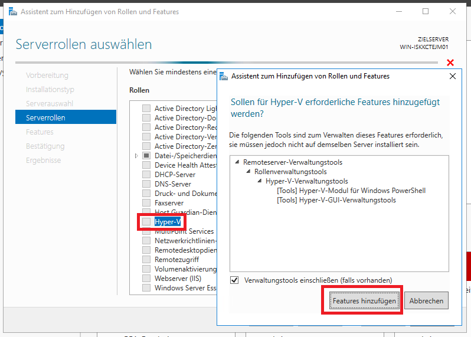
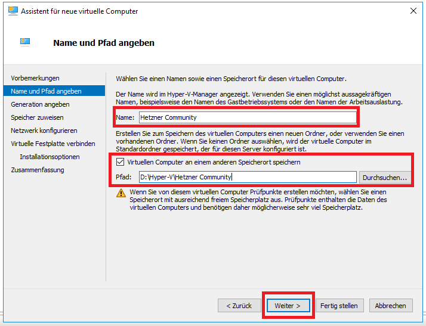
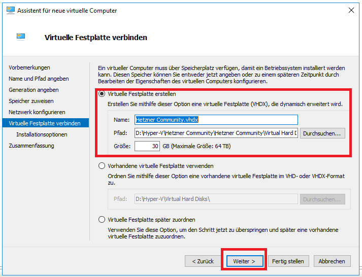
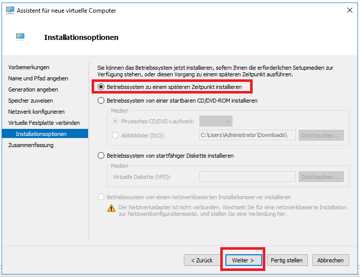

<!-- This where the actual tutorial begins. You don't need to write out the title again, having it in the frontmatter above is enough. -->

## Introduction

Hello, I am going to show you how to install your own virtual Windows server on an existing Windows server.

**Prerequisites**

Open a Webbrowser and head to "http://mirror.hetzner.de/bootimages/windows/".
(This only works with a server located in Hetzner's Network (Like the backup spaces))

Choose your wanted Windows version and download the .iso file.

Additional IP (The buying process is going to be included in the tutorial)
Windows server (This tutorial works with Windows Server 2016, other versions could have differences)
Remote desktop connection to the Windows server

## Step 1 - Additional IP

This step is only needed if you have not already bought an additional IP, if you have, proceed with step 2.

Login in to your robot account (https://robot.your-server.de ), now click on server and click on the server where you want to add the IP.

When you expand your server, click on "IPs" and then on the grey button in the left bottom corner "Order additional IPs / networks".

Now Chose "A paid IP (price (monthly): 1.00 € / Setup (once): 0.00 €)" and write as Reson for the IP "Virtual Server".

When your IP Order arrived proceed with step 2 

## Step 2 - Mac Address

Click on the Network icon right to the IP "Request separate MAC".

Now click on the red "Request separate MAC" Button, now you should see a Mac Adress which should look like this: MAC: 00:50:56:00:E5:7B

Copy and write down the MAC Address for later.

### Step 3 Hyper V Install

Login into your Windows Server via Remote desktop.

Start your Server manager and click on "Add Role or feature"

Skip every side until you come to Server role, there make a left click on the "Hyper V" box and click Add Features.

Now Skip until you can press "install" after the install please restart your Server once.

## Step 4 Setting up the Virtual Server

Start Hyper V, if you are not automatically connected Right-click on Hyper V Manager and Connect with your LOKAL Computer.

Klick at the right side on "New -> Virtual Computer".

Now Chose a Name, it can be any name, also you can assign a path where the VM should be installed to.
Click Next

Chose Generation 1.
Click Next

Now you can Setup the RAM of the Server, also you can activate Dynamic RAM which means that the Server does not use as an example, 16GB Ram, every time, the Server uses the RAM he needs + 20% Puffer if the server needs less RAM your main Server does need less RAM too.
I Chose for 16000GB ram with Dynamic RAM.
Click Next

Leave the Network config on "Not Connected"
Click Next

Now you can choose which size your hard drive gonna have, windows needs about 25GB.
Also, you can edit the Path.
Click Next

Now click on "Install OS Later"
Click Next

Click on "Finish"

Right Click on your new Virtual Machine and click on Settings.

Now you can edit your Hardware of the Server.

I would recommend to higher the core count for the install at least.

Head to Network card and chose your Virtual Switch connection.

After this expand "network card" by clicking und the plus and go to extended Features.

Click on Static Mac Address and fill in your previous copied MAC Address then Click on "Apply" and "OK"

You can now change how many cores your VM Should have aswell, I would give it the maximum amount of cores (or cores -1 for the Host system) that the install is short as possible, also you could do this for the RAM (8-12 GB should be more than enough).

Now head to "IDE-Controller 1" and click on "DVD Drive".

Click on an image file and now "search" the .iso you downloaded before.

Click "apply" and "ok"

## Step 5 Setting up Windows

Double-tap on your VM Name and then click on "Start".

Now you should see the Hyper V Logo following of Loading files and a Windows Logo.

When the Windows Setup started chose your Keyboard and language preferences you want and click on "continue".

Click on "Install now".

Chose the Windows Variant you would like for me its Windows Server 2016 Standart (IMPORTANT you need to install the version with (Desktop view) behind the name, without this you only get a command Shell, click on continue

Accept the License and click on continue

Now take custom 

Click on the Harddrive you want to install windows to (In my case there is only one), click continue

Now is your Server installing Windows you can now wait until its finished but don't Shutdown or suspend the VM or Host system

In the next Step your Administrator password.

After this, you can use your VM and have fun.

### Terminology
VM = Virtual Machine
Host System = Your Dedicated Server where the Virtual Machine is running on.
OS = Operating System
IP = Ip-Address

##### License: MIT

<!---

Contributors's Certificate of Origin

By making a contribution to this project, I certify that:

(a) The contribution was created in whole or in part by me and I have
    the right to submit it under the license indicated in the file; or

(b) The contribution is based upon previous work that, to the best of my
    knowledge, is covered under an appropriate license and I have the
    right under that license to submit that work with modifications,
    whether created in whole or in part by me, under the same license
    (unless I am permitted to submit under a different license), as
    indicated in the file; or

(c) The contribution was provided directly to me by some other person
    who certified (a), (b) or (c) and I have not modified it.

(d) I understand and agree that this project and the contribution are
    public and that a record of the contribution (including all personal
    information I submit with it, including my sign-off) is maintained
    indefinitely and may be redistributed consistent with this project
    or the license(s) involved.

Signed-off-by: TaktischerSpeck - Vincent Buß, vincent.buss@thelastgamer.de

-->

